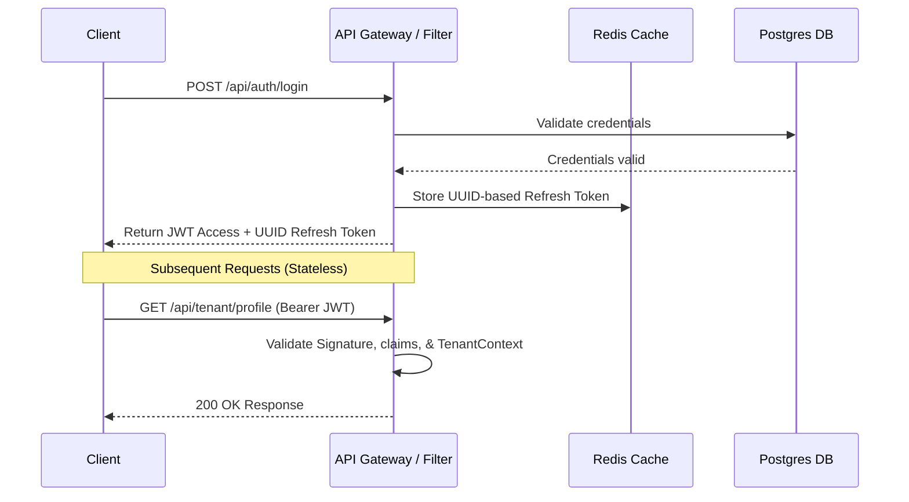

# QuantPOS Architectural Design Document

This document outlines the high-level engineering decisions, security controls, and design patterns implemented in **QuantPOS**, a Multi-Tenant Point of Sale (POS) and Inventory Management SaaS platform.

---

## 1. Multi-Tenancy Strategy

QuantPOS uses a **shared-database, shared-schema** multi-tenancy strategy (often referred to as logical data isolation). All tenant records reside in the same database instance, separated logically by a `tenant_id` column.

### Data Isolation Enforcers

1.  **Database Level**: 
    Most primary entities (such as `User`, `Terminal`, `Product`, `Transaction`) have a direct foreign key relation to the `Tenant` entity.
2.  **Application Level (Hibernate Filters)**:
    Rather than manually adding `WHERE tenant_id = ?` to every repository query, we utilize Hibernate `@FilterDef` and `@Filter` annotations on tenant-aware entities.
    *   A servlet filter or interceptor activates the filter on the active JPA `Session` at the start of each request.
    *   The filter value is dynamically set from `TenantContext.getTenantId()`.
3.  **ThreadLocal Context (`TenantContext`)**:
    The active tenant's UUID is stored in a thread-safe `ThreadLocal` wrapper. 
    *   `JwtFilter` extracts the `tenantId` claim from validated access tokens and populates `TenantContext`.
    *   To prevent memory leaks and cross-request contamination in the servlet thread pool, `TenantContext.clear()` is strictly invoked inside a `finally` block of the filter chain.

---

## 2. Authentication & Session Design

QuantPOS employs a hybrid **Stateless Access + Stateful Session** authentication pattern. This combines the performance of stateless JWTs with the immediate revocation control of server-managed sessions.



### The Three-Token Pattern

1.  **Access Token (JWT)**:
    *   **Stateless & Ephemeral**: Valid for 15 minutes.
    *   **Payload Claims**: Embeds `userId` (subject), `tenantId`, `role`, `email`, and `businessName`.
    *   **Cryptographic Signature**: Signed with a minimum 256-bit key using the HS256 HMAC-SHA algorithm.
2.  **Refresh Token (UUID)**:
    *   **Stateful**: Saved in Redis mapped to the `userId` with a Time-To-Live (TTL) of 7 days.
    *   **Token Rotation**: On each `/refresh` invocation, the old refresh token is immediately deleted (single-use), and a new refresh token is issued to the client.
    *   **Instant Revocation**: Logouts instantly delete the refresh token from Redis, ending the session.
3.  **One-Time Verification & Recovery Tokens (UUID)**:
    *   Used for email verification (TTL 24 hours) and password reset (TTL 1 hour).
    *   Stored in Redis. Once validated, they are deleted instantly to prevent replay attacks.

---

## 3. Security Decisions

*   **BCrypt Hashing**: Passwords are encrypted using Spring Security's `BCryptPasswordEncoder` with a work factor of 12. This balances protection against brute-force attacks with server throughput.
*   **Enumeration Prevention**:
    *   During registration, password recovery, or login, the API avoids giving detailed clues about whether an email exists or not (e.g., `/forgot-password` returns 200 OK and a generic message regardless of email existence).
*   **Token Hijacking Protection**:
    *   If a rotated refresh token is reused, it indicates potential token theft. A security system can be wired to detect reuse and clear all sessions associated with that user ID (future enhancement).

---

## 4. Role Hierarchy and Method-Level Security

Authorization is managed at the method level using Spring Security's `@PreAuthorize` annotation, coupled with role-based checks. 

The system defines four distinct roles:

1.  **SUPER_ADMIN**: Platform administrators. Can view/modify all tenant records globally.
2.  **OWNER**: Tenant creator. Full access to tenant data, profile settings, terminal registrations, billing settings, and cashier records.
3.  **MANAGER**: Administrative user within a tenant. Access to inventory, reports, and sales data. Cannot modify billing configurations or delete the tenant.
4.  **CASHIER**: POS operator. Limited access. Can process transactions and view low-level catalog details.

### Implementation Example
```java
@RestController
@RequestMapping("/api/tenant")
public class TenantController {
    
    @GetMapping("/profile")
    @PreAuthorize("hasAnyRole('OWNER', 'MANAGER')")
    public ResponseEntity<ApiResponse<Tenant>> getProfile() { ... }

    @PutMapping("/profile")
    @PreAuthorize("hasRole('OWNER')")
    public ResponseEntity<ApiResponse<Tenant>> updateProfile(...) { ... }
}
```

---

## 5. Error Response Standardization

All endpoints return a uniform response body schema represented by `ApiResponse<T>`.

### Unified Payload JSON Schema
```json
{
  "success": false,
  "message": "Validation failed",
  "errorCode": "VALIDATION_FAILED",
  "details": "addressPincode: Pincode must be 6 digits",
  "data": null
}
```

### Global Exception Mapping
The `GlobalExceptionHandler` converts standard Spring and JSR-380 exceptions into standard HTTP status codes:

*   `ApiException` -> Specific code, custom HTTP status, message
*   `MethodArgumentNotValidException` / `ConstraintViolationException` -> HTTP 400 Bad Request
*   `HttpMessageNotReadableException` (Malformed JSON) -> HTTP 400 Bad Request
*   `AccessDeniedException` -> HTTP 403 Forbidden
*   `AuthenticationException` -> HTTP 401 Unauthorized
*   `DataIntegrityViolationException` (Duplicate constraint, etc.) -> HTTP 409 Conflict
*   `MaxUploadSizeExceededException` -> HTTP 413 Payload Too Large
*   `HttpRequestMethodNotSupportedException` -> HTTP 405 Method Not Allowed
*   `HttpMediaTypeNotSupportedException` -> HTTP 415 Unsupported Media Type
*   `Exception` (Unhandled fallback) -> HTTP 500 Internal Server Error

---

## 6. Future Roadmap

1.  **Stripe Billing Portals**: Fully integrate webhook handlers to lock/unlock tenant checkout capabilities automatically when payment declines or sub-tiers expire.
2.  **Physical POS Terminals**: Support localized terminal hardware integrations via WebSocket streaming.
3.  **Real-Time Stock Alerts**: Publish inventory low-stock conditions directly to Slack, email, or WhatsApp.
4.  **OpenAI REST API Predictive Model**: Deploy regression agents reading historical ledger entries to automatically draft wholesale restocking spreadsheets.
